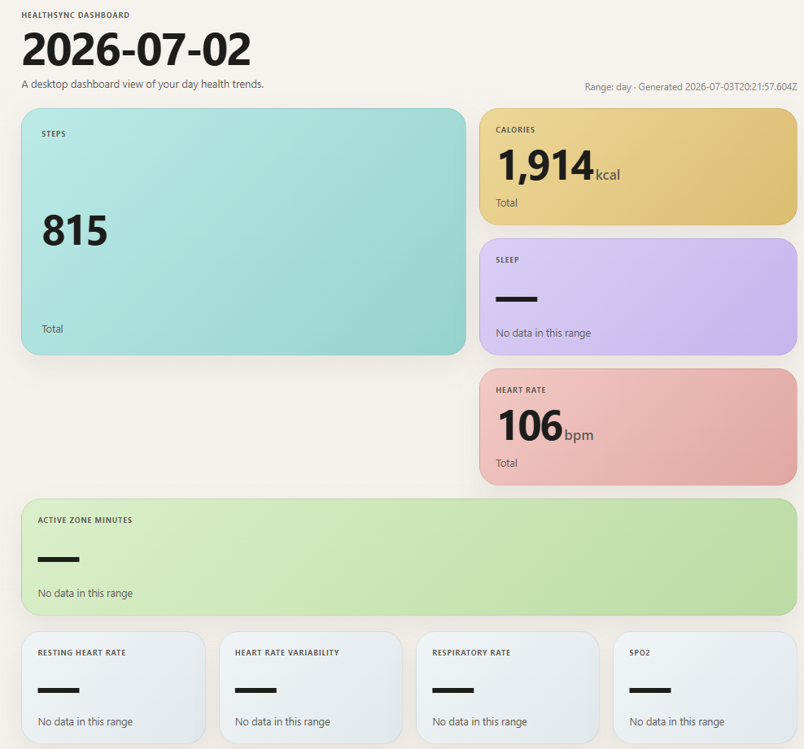
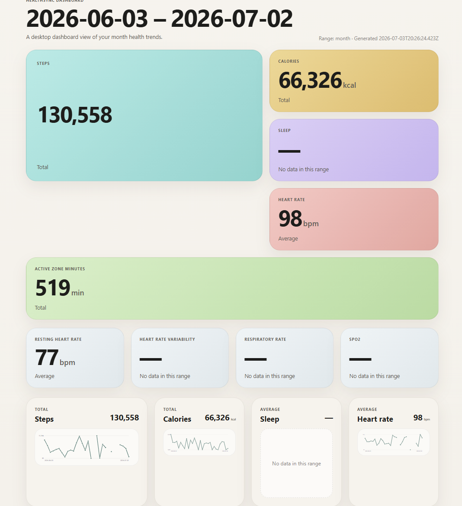
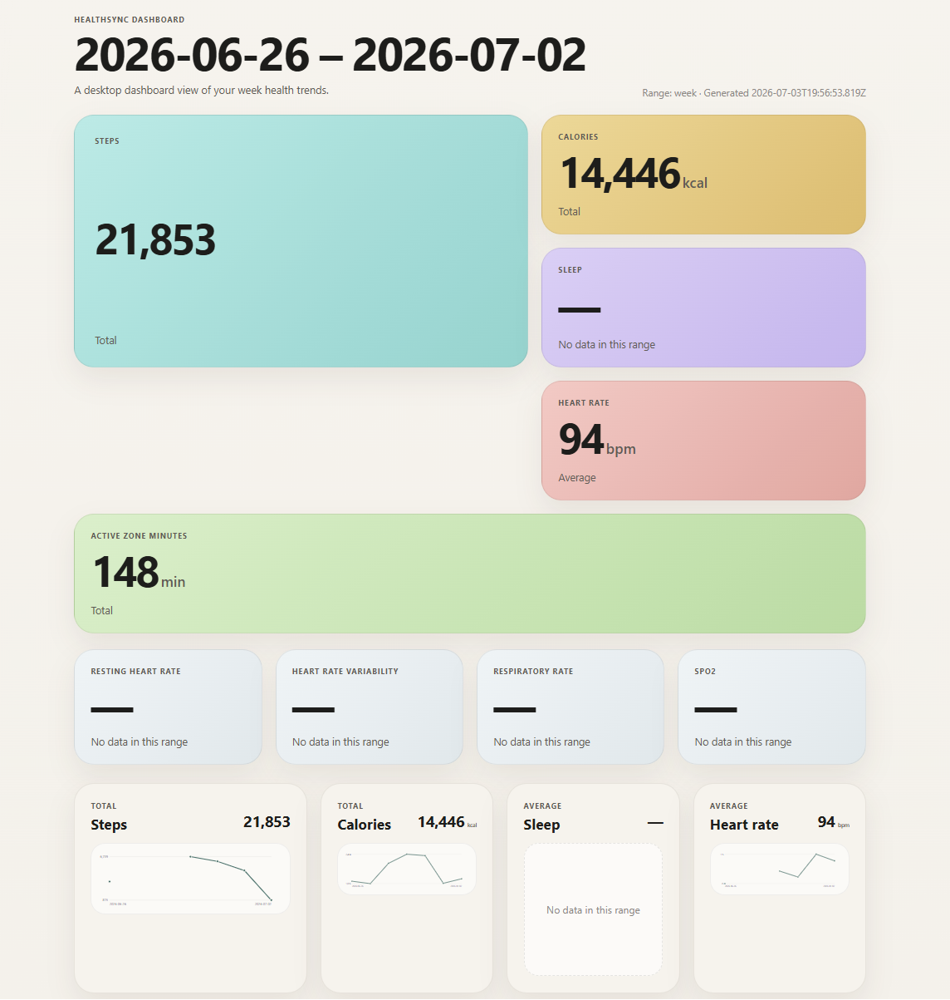

# HealthSync

Turn Google Health data into a beautiful personal dashboard and daily archive.

HealthSync syncs Pixel Watch and Google Health metrics into your own Google Drive, keeps raw day-by-day exports, writes markdown notes for journaling workflows, and generates a polished static dashboard for quick review.

## Dashboard Demo

### Day



### Month



### Week



## Highlights

- Syncs Google Health / Pixel Watch data into your own Google Drive
- Generates a desktop-friendly dashboard for day, week, and month views
- Archives raw daily JSON for long-term reference and reprocessing
- Writes markdown daily notes that work well with Obsidian-style journaling
- Keeps credentials and data ownership in your own Google Cloud / Drive setup

## Quick Start

### Prerequisites

- Node.js 22 LTS
- pnpm 9+
- A Pixel Watch linked to your Google account
- Your own Google Cloud project with OAuth credentials for Google Health and Google Drive

### Install

```bash
pnpm install
pnpm build
cd packages/cli
pnpm link --global
```

This builds both workspace packages (`@healthsync/core` and `@healthsync/cli`) into `packages/*/dist` and makes the `healthsync` command available in your shell.

### First Run

```bash
healthsync connect
healthsync sync
healthsync dashboard --range week
```

## Google Cloud Setup

HealthSync does not ship with shared Google Cloud credentials. For local use, create your own Google Cloud project and configure OAuth against your own Google account.

1. Go to <https://console.cloud.google.com/> and create a project.
2. Enable:
   - Google Health API
   - Google Drive API
3. Configure the OAuth consent screen:
   - User Type: **External**
   - Add yourself as a Test User
   - Add these scopes:
     - `https://www.googleapis.com/auth/googlehealth.activity_and_fitness.readonly`
     - `https://www.googleapis.com/auth/googlehealth.health_metrics_and_measurements.readonly`
     - `https://www.googleapis.com/auth/googlehealth.sleep.readonly`
     - `https://www.googleapis.com/auth/drive.file`
4. Create an OAuth client ID with application type **Desktop app**.
5. Copy the client ID and client secret into `.env`:

```bash
cp .env.example .env
```

```bash
HEALTHSYNC_CLIENT_ID=your-client-id.apps.googleusercontent.com
HEALTHSYNC_CLIENT_SECRET=your-client-secret
```

The CLI automatically loads `.env` from the repository root. Shell environment variables still take precedence if both are set.

## Usage

```bash
# First-time authorization
healthsync connect

# Headless / remote authorization
healthsync connect --manual

# Check auth state
healthsync auth status

# Revoke local tokens
healthsync auth logout

# Sync yesterday's data
healthsync sync

# Backfill starting from a date
healthsync sync --full --since 2026-01-01

# Limit to specific data types
healthsync sync --types steps,sleep

# Overwrite existing files in Drive
healthsync sync --force

# Machine-readable output
healthsync sync --json

# Inspect synced days
healthsync list
healthsync list --json

# Generate a dashboard
healthsync dashboard --range week

# Show effective config
healthsync config show
healthsync config show --json
```

Supported data types: `steps`, `heart-rate`, `sleep`, `active-zone-minutes`, `spo2`.

## Remote Authorization

If the CLI runs on a remote server and your browser runs locally, use an SSH tunnel so Google's loopback redirect can still reach the remote CLI listener.

From your laptop:

```bash
ssh -L 53682:127.0.0.1:53682 user@remote-server
```

Then on the remote server:

```bash
healthsync connect --no-open --port 53682
```

As a fallback, you can always use:

```bash
healthsync connect --manual
```

## Tokens on Disk

After `connect`, OAuth tokens are stored at:

- Linux / macOS: `~/.config/healthsync/tokens.json`
- Windows: `%APPDATA%\healthsync\tokens.json`

Treat the token file, `.env`, and downloaded credential files as secrets.

## What Gets Generated

```text
HealthSync/
├── raw/YYYY/MM/YYYY-MM-DD_<type>.json
├── daily/YYYY/MM/YYYY-MM-DD.md
├── dashboard.html
└── .state/sync-state.json
```

- `raw/` — immutable per-type JSON archives
- `daily/` — rendered markdown daily notes with links back to raw files
- `dashboard.html` — self-contained HTML dashboard saved to Drive and locally (for example `~/.config/healthsync/dashboard.html`)
- `.state/sync-state.json` — last-successful-sync bookkeeping used for incremental runs

Point your Obsidian vault at `daily/` or a synced local copy if you want to browse the generated notes there.

## Configuration

HealthSync ships with defaults, but you can override them with a JSON file at:

- Linux / macOS: `~/.config/healthsync/config.json`
- Windows: `%APPDATA%\healthsync\config.json`

Example:

```json
{
  "driveRootFolder": "HealthSync",
  "dataTypes": ["steps", "calories", "heart-rate", "resting-heart-rate", "heart-rate-variability", "respiratory-rate", "sleep", "active-zone-minutes", "spo2"],
  "logLevel": "info"
}
```

Use `healthsync config show` to inspect the effective merged configuration.

## Development

```bash
pnpm typecheck
pnpm test
pnpm lint
pnpm format
```

End-to-end coverage lives in `packages/core/test/e2e/`.

## Known Limitations

- `--full` is currently a no-op. The flag is accepted, but the sync orchestrator does not yet re-fetch past successful days.
- `--dry-run` is currently a no-op. The flag is accepted, but the sync still uploads.
- On Windows, `tokens.json` inherits NTFS ACLs from the parent directory instead of enforcing Unix-style `0600`.
- Google Health API behavior may still change as the platform stabilizes, so real-world integrations can still expose API-shape differences.

## Architecture

See `docs/superpowers/specs/2026-04-19-healthsync-design.md` for the design, and `docs/superpowers/plans/2026-04-19-healthsync-cli-mvp.md` for the original implementation plan behind the MVP.
